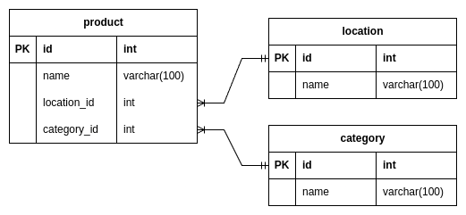

# Product Search Service

---

## Table of content

- [Project Overview](#project-overview)
- [Tech Stack](#tech-stack)
- [Getting Started](#getting-started)
  - [Prerequisites](#prerequisites)
  - [Installation](#installation)
  - [Running the application](#running-the-application)
  - [Available NPM Scripts](#available-npm-scripts)
- [API Documentation](#api-documentation)
  - [GET /product/search](#get-productsearch)
  - [GET /product/suggestion](#get-productsuggestion)
  - [GET /product/autocomplete](#get-productautocomplete)
- [Configuration](#configuration)
- [Project Structure](#project-structure)
  - [Folder Overview](#folder-overview)
  - [Postgresql Database Schema](#postgresql-database-schema)
- [Future Improvements](#future-improvements)

## Project Overview

This project is a NestJS-based backend API that provides an advanced and scalable search functionality for products. The goal is to deliver fast and relevant search results across product names, categories, and locations.

Key highlights of the system include:

- Autocomplete suggestions using Redis

- Relevance-based ranking to prioritize the most relevant results

- Alternative query suggestions to guide users when no or few results are found

- Modular, clean, and maintainable architecture

- Full support for Docker-based deployment

## Tech Stack

- **NestJS** – Progressive Node.js framework for building efficient and scalable server-side applications

- **PostgreSQL** – Relational database used for persistent storage of product data

- **Redis** – In-memory data store used for caching and speeding up autocomplete suggestions

- **Docker** – Containerization for consistent development and deployment environments

## Getting Started

Follow these steps to get the project up and running locally or using Docker.

### Prerequisites

Make sure you have the following installed:

- **Node.js** (v20 or higher)

- **Docker** (for Dockerized setup)

- **Docker** Compose (if using Docker)

### Installation

1. **Clone the repository**

```bash
git clone https://github.com/AJ-Niro/ProductSearchService.git
cd ProductSearchService
```

2. **Copy default environment variables**

```bash
cp .example.env .env
```

3. **Install dependencies**

```bash
npm install
```

### Database Setup

1. Start PostgreSQL and Redis using the development infra file:

```bash
  docker compose --env-file .env -f docker/docker-compose.infra.yml up -d
```

2. **Migrations** are handled using `@nestjs/typeorm` and configured in the project.

- To run migrations:

```bash
  npm run migration:run
```

3. **Seeding with Fake Data** is available via a custom factory script:

- To populate PostgreSQL with demo/fake data:

```bash
   npm run factory <entity> <number_of_records>
```

- The available entities are:
  - **location**
  - **category**
  - **product**

### Running the application

**Option 1: Local Development (Preferred)**

1. Start the NestJS app:

   - The API will be running at http://localhost:3000

```bash
  npm run start:dev
```

**Option 2: Production Mode (Dockerized)**

- Docker is configured for production deployment only.

1.  Make sure that have previously configure and a postgresql and redis instance

2.  Build and start the container:

```bash
docker compose --env-file .env -f docker/docker-compose.app.yml up
```

### Available NPM Scripts

| Script           | Description                                                                                                                                     |
| ---------------- | ----------------------------------------------------------------------------------------------------------------------------------------------- |
| build            | Compiles the NestJS project using the Nest CLI.                                                                                                 |
| format           | Formats all TypeScript files in `src` and `test` directories using Prettier.                                                                    |
| start            | Starts the NestJS application in production mode.                                                                                               |
| start:dev        | Starts the application in development mode with file watching for auto-reload.                                                                  |
| start:debug      | Starts the application in debug mode with auto-reload support.                                                                                  |
| start:prod       | Runs the compiled application directly with Node.js (typically for production).                                                                 |
| typeorm:cli      | Runs the TypeORM CLI with TypeScript and path alias support.                                                                                    |
| migration:create | Creates a new database migration. Pass the name via `--name=MigrationName`.                                                                     |
| migration:run    | Runs all pending database migrations using the provided data source.                                                                            |
| migration:revert | Reverts the last executed migration.                                                                                                            |
| migration:show   | Lists all pending migrations that have not yet been run.                                                                                        |
| factory          | Runs the database factory script to populate initial data. Requires two parameters: entity name and count (e.g., `npm run factory category 5`). |
| lint             | Lints TypeScript files across project directories and applies auto-fixes.                                                                       |
| test             | Runs the project's unit tests using Jest.                                                                                                       |
| test:watch       | Runs tests in watch mode, re-running them on file changes.                                                                                      |
| test:cov         | Runs tests and reports test coverage.                                                                                                           |
| test:debug       | Runs Jest in debug mode for step-by-step test debugging.                                                                                        |
| test:e2e         | Executes end-to-end (e2e) tests using the specified Jest configuration.                                                                         |

## API Documentation

### `GET /product/search`

Search products by query with pagination.

**Query Parameters**

| Name       | Type   | Require | Description                  |
| ---------- | ------ | ------- | ---------------------------- |
| `q`        | string | yes     | The search query             |
| `page`     | number | no      | Page number (default: 1)     |
| `per_page` | number | no      | Items per page (default: 10) |

**Example Response**

```json
{
  "items": [
    // array of products found
  ],
  "meta": {
    "totalItems": 4,
    "itemCount": 4,
    "itemsPerPage": "10",
    "totalPages": 1,
    "currentPage": "1"
  }
}
```

### `GET /product/suggestion`

Get alternative search suggestions based on a query.

**Query Parameters**

| Name    | Type   | Require | Description                                 |
| ------- | ------ | ------- | ------------------------------------------- |
| `q`     | string | yes     | The search query                            |
| `limit` | number | no      | Maximum number of suggestions (default: 10) |

**Example Response**

```json
{
  "items": [
    /* array of suggestion strings */
  ]
}
```

### `GET /product/autocomplete`

Get autocomplete suggestions by prefix using Redis.

**Query Parameters**

| Name     | Type   | Require | Description                                 |
| -------- | ------ | ------- | ------------------------------------------- |
| `prefix` | string | yes     | Partial input from user                     |
| `limit`  | number | no      | Maximum number of suggestions (default: 10) |

**Example Response**

```json
{
  "items": [
    /* array of autocomplete suggestions strings */
  ]
}
```

## Configuration

The application is configured using environment variables. A `.example.env` file is provided in the project root as a template.

**Example `.example.env` File**

```.env
POSTGRES_HOST=localhost
POSTGRES_PORT=5432
POSTGRES_USER=user
POSTGRES_PASSWORD=password
POSTGRES_DB=ProductSearchService

REDIS_HOST=localhost
REDIS_PORT=6379
REDIS_PASSWORD=password
```

**To get started**, copy this file and rename it to .env, then adjust values as needed:

```bash
cp .example.env .env
```

### Caching Strategy

To optimize autocomplete performance, the application uses Redis to cache frequently searched prefixes.

- The cache is updated automatically every 30 seconds using a background cronjob.

- This ensures autocomplete data stays in sync with the PostgreSQL product records without adding write-time overhead.

- Redis TTLs are not used, as updates are handled by the scheduled task.

- You can find the implementation under `src/product/product.service.ts` on the `populateAutocompleteCache` method

## Project Structure

### Folder Overview

```
.
├── docker/                       # Docker-related files (Dockerfile, docker-compose)
│   ├── Dockerfile                # Production Dockerfile
│   ├── .dockerignore             # Ignore files
│   ├── docker-compose.app.yml    # Compose file for production
│   └── docker-compose.infra.yml  # Compose file for local infra (PostgreSQL, Redis)
├── src/
│   ├── app/                      # Application modules (product, category, location)
│   │   ├── product/
│   │   ├── category/
│   │   └── location/
│   ├── config/                   # Application configuration (e.g., database config)
│   ├── database/                 # DB migrations and factories for test/fake data
│   │   ├── migrations/
│   │   └── factory/
│   ├── shared/                   # Reusable utilities.
│   ├── main.ts                   # Application entry point
│   └── app.module.ts             # Root module definition
├── test/                         # Unit and e2e tests
├── .example.env                  # Example environment configuration
└── README.md
```

### Postgresql Database Schema



## Future Improvements

- Full-Text Search with Weights:
Enhance relevance ranking using PostgreSQL’s full-text search features like tsvector, tsquery, and custom weighting by field (e.g., boost name over location).

- Advanced Filtering Capabilities:
Support dynamic filters (e.g., by category, price range, location radius) to improve the search experience.

- Multi-language Support:
Add localization support for product names, categories, and suggestions to support international users.

- User Search History & Analytics:
Store anonymized query logs for analytics, suggestion training, or ranking adjustments.

- Unit & Integration Test Coverage:
Expand test coverage, especially for search ranking logic, pagination, and caching mechanisms.

- CI/CD Pipeline:
Set up GitHub Actions or similar tools for automated testing, linting, and deployment to staging/production environments.